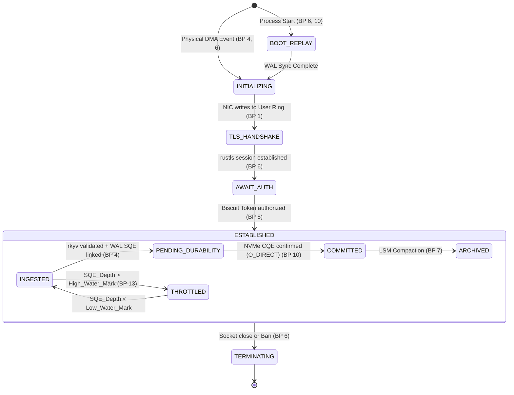

# VORTEX Exhaustive Logical Blueprint: Technical Atlas

This atlas provides a 1:1 mapping of all functional and logical relationships within VORTEX, integrating all 13 blueprints into a unified technical specification.

---

## 1. System Topology & Hardware Symbiosis
*Integrating Blueprints 2 (Infrastructure), 13 (Concurrency), and 3 (Memory Layout).*

### Core-Locked Hierarchy
VORTEX operates as a "hard-real-time" system where software and hardware are statically aligned.

| Layer | Component/Function | Logic & Constraint | Blueprint Ref |
| :--- | :--- | :--- | :--- |
| **Physical** | `AMD EPYC / Ampere` | High Lane count PCIe Gen 5. SMT de-prioritized to avoid ALU starvation. | BP 2, 13 |
| **I/O Routing** | `MSI-X Interrupts` | 1:1 Pinning: NIC Queue N -> Core N. Zero-Migration pathway. | BP 13 |
| **Memory** | `1GB/2MB HugePages` | Bypassing OS Page Cache; Zero TLB thrashing during random vector access. | BP 2, 3 |
| **NUMA Isolation** | `Local Node Allocation` | Strict socket-locality for RAM to avoid UPI/QPI interconnect latency. | BP 2, 13 |
| **Kernel Tuning** | `isolcpus` / `cgroup v2` | "Noise-Free Execution Chamber": System services banished to Control Cores (0,1). | BP 2 |

---

## 1.5 Memory Sovereignty Map
*Integrating Blueprints 3 (Layout), 4 (Sequence), and 5 (Modules).*

The buffer lifecycle ensures zero-copy performance while adhering to Rust's strict ownership and the Borrow Checker's constraints.

| Stage | Owner | Access Type | Buffer State |
| :--- | :--- | :--- | :--- |
| **Ingress** | Kernel Ring | Exclusive | Pre-Allocated / Dirty |
| **Arrival** | `vortex-io` (`RingDriver`) | `&mut [u8]` (Unique) | Leased from Ring |
| **Parsing** | `vortex-rpc` (`rkyv`) | `&[u8]` (Shared/Ref) | Validated / Archive |
| **Persist** | `io_uring` (Disk) | `&[u8]` (Const Pointer) | Locked for Write |
| **Release** | `RingDriver` | Reclaim | Returned to Pool |

> [!IMPORTANT]
> **Persistence Lock**: Buffers are pinned and unavailable for reuse until the Disk CQE returns. This prevents data corruption during asynchronous writes.

---

## 2. Command Lifecycle & FSM Coordination
*Integrating Blueprints 4 (Sequence), 6 (FSM), 9 (Protocol), and 10 (Failure).*

### The Transaction Pipeline (e.g., CMD_UPSERT)
Every request travels through a multi-FSM gauntlet to ensure ACID durability and zero-copy performance.



### The Flow-Control Valve (Backpressure)
- **Condition**: If `SQE_Depth` (Pending Disk Writes) > `High_Water_Mark` (e.g., 256).
- **Mechanism**: The Shard stops submitting `IORING_OP_RECV` requests.
- **Effect**: TCP Window fills, naturally slowing the client without explicit rate-limiting code.

### State: BOOT_REPLAY (Cold Path Recovery)
- **Ingress Status**: OFFLINE. (Ports bound but not `accept()`ing).
- **Process**:
    1. `ShardCoordinator` locks memory arenas.
    2. Reads `MANIFEST` to find last checkpoint.
    3. `StreamingIterator` replays WAL entries $> LDSN$.
    4. Invokes `MemTable::replay_insert()`.
- **Termination**: Transition to `ACTIVE_RUNNING` (allowing `accept()`) only when `WAL_EOF` is verified.
```

### Functional Relationship Map (Write Path)
1. **Ingress Stage (vortex-io)**: 
   - `io_uring_enter` -> `IORING_OP_RECV` -> `rkyv::check_archive`.
   - Relation: Validates that input bytes match the `RequestFrame` (BP 9) layout without allocating memory.
2. **Durability Stage (vortex-core)**:
   - `WriteAheadLog::append()` -> `iosqe_io_link` -> `O_DIRECT | O_DSYNC`.
   - Relation: The `Transaction Pipeline FSM` (BP 6) is suspended via the `Reactor Loop` (BP 13) until the SSD controller returns success.
3. **Visibility Stage (vortex-core)**:
   - `ShardCoordinator::apply_mutation()` -> `MemTable::insert()`.
   - Relation: Memory mutation ONLY happens after `COMMITTED` state is reached (BP 6, 10).
4. **Egress Stage (vortex-io)**:
   - `ResponseFormatter::build(CorrelationID)` -> `IORING_OP_SEND`.
   - Relation: Uses the symmetric `ResponseStatus` (BP 9) structure to acknowledge success/failure.

---

## 3. Storage Architecture & Maintenance Logic
*Integrating Blueprints 3 (Layout), 5 (Modules), and 7 (Compaction).*

### LSM-Tree & Graph Engine Integration
Compaction is not just for disk space; it is the factory for the high-speed search index.

| Process | Component | Action / Logic |
| :--- | :--- | :--- |
| **Buffering** | `MemTable` | Skiplist/RB-Tree in RAM. Single-Writer (no lock) optimization. | BP 3 |
| **Snapshot** | `SSTable` | Page-aligned (4KB) immutable blocks. CRC32 footer for Bit-Rot check. | BP 3, 10 |
| **Search Index** | `HNSW Graph` | CSR adjacency links using 32-bit internal offsets for `mmap` safety. | BP 3 |
| **Maintenance** | `Leaky Bucket Limiter` | Throttles background I/O to prioritize real-time Read requests. | BP 7 |
| **Heuristic** | `Tombstone Debt` | If >20% deleted, trigger `CompactionJob` to bottom level. | BP 7 |

---

## 4. Observability & Introspection (Zero-Overhead)
*Integrating Blueprints 12 (Telemetry) and 5 (Modules).*

- **Mechanism**: Thread-Local Metrics -> `Seqlock` Aggregation -> Aggregator Sidecar.
- **Trace Logic**: "Tail-Based Sampling": Ring-buffer stores last 1,000 requests; only dumped to `NDJSON` (BP 12) if latency > P99 or an Error Status (BP 9) occurs.
- **Introspection**: `eBPF` probes hook `sys_io_uring_enter` to build Flamegraphs of Off-CPU time.

---

## 5. Formal Verification & Error Boundaries
*Integrating Blueprints 8 (Security), 11 (Verification), and 10 (Recovery).*

### Error Boundary Hierarchy
- **Level 1 (Logical)**: `Result<T, E>` / `ERR_INPUT`.
- **Level 2 (Panic)**: `catch_unwind` wraps the Shard loop. If Shard 0 panics, it resets volatile state; Shard 1 continues.
- **Level 3 (Durability)**: WAL Checksum mismatch. Truncate incomplete tail (BP 10).
- **Level 4 (Corruption)**: SSTable CRC fail. Trigger Self-Repair from Raft Peer (BP 10).

### Verification Grid
- **Differential Fuzzing**: SIMD math CROSS-CHECKED with Scalar implementation.
- **Deterministic Simulation**: Seeded RNG controls Time/IO to eliminate Heisenbugs.
- **Jepsen Nemesis**: External process SIGSTOP/SIGCONT to verify linearizability under partition.

---

## 7. Adaptive Hardware Resilience (Sub-Optimal Fallbacks)
VORTEX must not crash due to hardware limitations; it must adapt its policy while maintaining maximal possible performance.

### Capability Detection & Policy
| Feature | Optimal (NVMe/DDR5) | Fallback (SATA/DDR4) | Logic Constraint |
| :--- | :--- | :--- | :--- |
| **Memory Locking** | `mlockall(MCL_FUTURE)` | On-Demand Paging Warn | If `ENOMEM`, log WARNING and proceed with soft-limits but warn about jitter. |
| **Storage I/O** | `NVMe Direct I/O` | `Generic O_DIRECT` | Detect if device is `block` or `nvme`. Adjust `io_uring` polling depth accordingly. |
| **I/O Alignment** | 4096-byte (Standard) | Detect via `ioctl(BLKSSZGET)` | Force buffer alignment to the detected physical sector size. |
| **Vector Math** | `AVX-512` | `AVX2` / `Scalar` | Runtime dispatch via `is_x86_feature_detected!`. |
